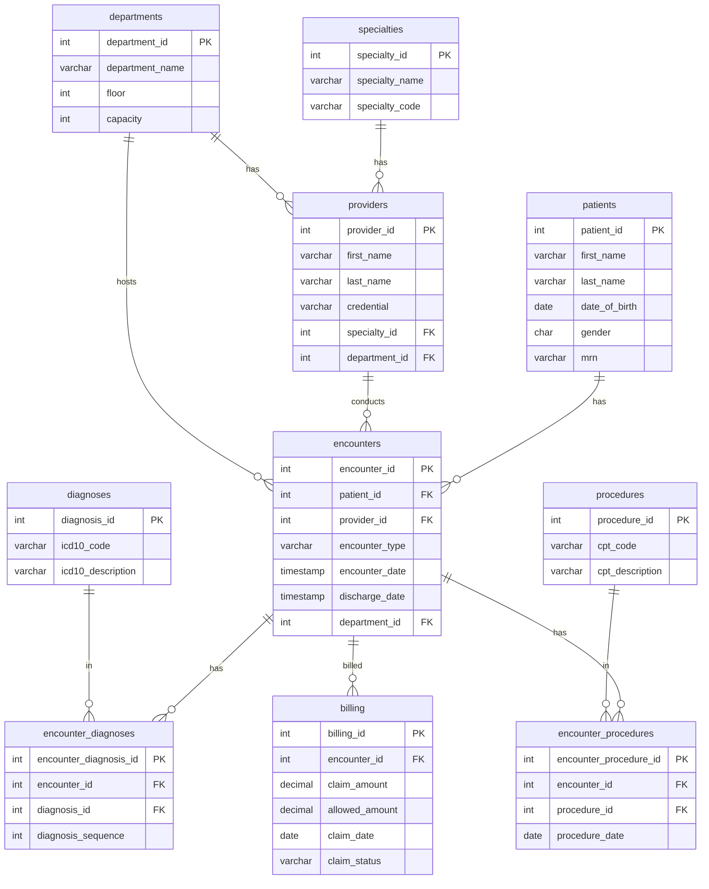

```mermaid
erDiagram
  patients {
    int patient_id PK
    varchar first_name
    varchar last_name
    date date_of_birth
    char gender
    varchar mrn
  }
  specialties {
    int specialty_id PK
    varchar specialty_name
    varchar specialty_code
  }
  departments {
    int department_id PK
    varchar department_name
    int floor
    int capacity
  }
  providers {
    int provider_id PK
    varchar first_name
    varchar last_name
    varchar credential
    int specialty_id FK
    int department_id FK
  }
  encounters {
    int encounter_id PK
    int patient_id FK
    int provider_id FK
    varchar encounter_type
    timestamp encounter_date
    timestamp discharge_date
    int department_id FK
  }
  diagnoses {
    int diagnosis_id PK
    varchar icd10_code
    varchar icd10_description
  }
  encounter_diagnoses {
    int encounter_diagnosis_id PK
    int encounter_id FK
    int diagnosis_id FK
    int diagnosis_sequence
  }
  procedures {
    int procedure_id PK
    varchar cpt_code
    varchar cpt_description
  }
  encounter_procedures {
    int encounter_procedure_id PK
    int encounter_id FK
    int procedure_id FK
    date procedure_date
  }
  billing {
    int billing_id PK
    int encounter_id FK
    decimal claim_amount
    decimal allowed_amount
    date claim_date
    varchar claim_status
  }

  patients         ||--o{ encounters          : "has"
  providers        ||--o{ encounters          : "conducts"
  specialties      ||--o{ providers           : "has"
  departments      ||--o{ providers           : "has"
  departments      ||--o{ encounters          : "hosts"
  encounters       ||--o{ encounter_diagnoses : "has"
  diagnoses        ||--o{ encounter_diagnoses : "in"
  encounters       ||--o{ encounter_procedures: "has"
  procedures       ||--o{ encounter_procedures: "in"
  encounters       ||--o{ billing             : "billed"
```