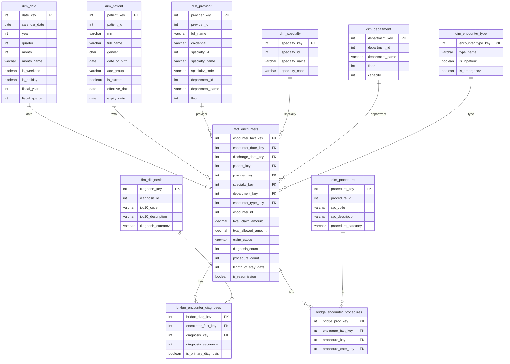

```mermaid
erDiagram
  dim_date {
    int date_key PK
    date calendar_date
    int year
    int quarter
    int month
    varchar month_name
    boolean is_weekend
    boolean is_holiday
    int fiscal_year
    int fiscal_quarter
  }
  dim_patient {
    int patient_key PK
    int patient_id
    varchar mrn
    varchar full_name
    char gender
    date date_of_birth
    varchar age_group
    boolean is_current
    date effective_date
    date expiry_date
  }
  dim_provider {
    int provider_key PK
    int provider_id
    varchar full_name
    varchar credential
    int specialty_id
    varchar specialty_name
    varchar specialty_code
    int department_id
    varchar department_name
    int floor
  }
  dim_specialty {
    int specialty_key PK
    int specialty_id
    varchar specialty_name
    varchar specialty_code
  }
  dim_department {
    int department_key PK
    int department_id
    varchar department_name
    int floor
    int capacity
  }
  dim_encounter_type {
    int encounter_type_key PK
    varchar type_name
    boolean is_inpatient
    boolean is_emergency
  }
  dim_diagnosis {
    int diagnosis_key PK
    int diagnosis_id
    varchar icd10_code
    varchar icd10_description
    varchar diagnosis_category
  }
  dim_procedure {
    int procedure_key PK
    int procedure_id
    varchar cpt_code
    varchar cpt_description
    varchar procedure_category
  }
  fact_encounters {
    int encounter_fact_key PK
    int encounter_date_key FK
    int discharge_date_key FK
    int patient_key FK
    int provider_key FK
    int specialty_key FK
    int department_key FK
    int encounter_type_key FK
    int encounter_id
    decimal total_claim_amount
    decimal total_allowed_amount
    varchar claim_status
    int diagnosis_count
    int procedure_count
    int length_of_stay_days
    boolean is_readmission
  }
  bridge_encounter_diagnoses {
    int bridge_diag_key PK
    int encounter_fact_key FK
    int diagnosis_key FK
    int diagnosis_sequence
    boolean is_primary_diagnosis
  }
  bridge_encounter_procedures {
    int bridge_proc_key PK
    int encounter_fact_key FK
    int procedure_key FK
    int procedure_date_key FK
  }

  dim_date             ||--o{ fact_encounters             : "date"
  dim_patient          ||--o{ fact_encounters             : "who"
  dim_provider         ||--o{ fact_encounters             : "provider"
  dim_specialty        ||--o{ fact_encounters             : "specialty"
  dim_department       ||--o{ fact_encounters             : "department"
  dim_encounter_type   ||--o{ fact_encounters             : "type"
  fact_encounters      ||--o{ bridge_encounter_diagnoses  : "has"
  dim_diagnosis        ||--o{ bridge_encounter_diagnoses  : "in"
  fact_encounters      ||--o{ bridge_encounter_procedures : "has"
  dim_procedure        ||--o{ bridge_encounter_procedures : "in"
```